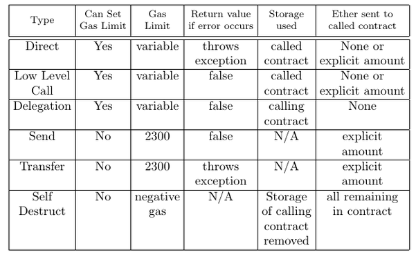

# Smart Contract Interactions
This folder lists examples of all the ways two smart contracts written in Solidity can interact, as well as some common problems solidity programmers come across. 

## Different Smart Contract Invocations

Given a smart contract s^i, there are six different ways s^i can invoke and interact with another smart contract s^j. I will describe these six different invocation categories below.

Note that in the following I use `<ContractType>`, `<langle ContractName>`, `<FunctionName>`, `<ContractAddress>` and `<Recipient>` as placeholders.

* __Direct Invocation__  new `<ContractType>` __or__ `<langle ContractName>`.`<FunctionName>` -  This invocation method is the most simple way for smart contract s^i to interact with a function f^x in smart contract s^j. If f^x happens to be contract s^j's constructor, this is implicitly called through the new keyword followed by a reference to the type of s^j. Otherwise if f^x is not a constructor,  s^i must have already instantiated a variable representing s^j through prior knowledge of `<ContractAddress>`. 

* __Low Level Call Invocation__ `<ContractAddress>`.call(...) - This invocation method  allows smart contract s^i to invoke any function of smart contract s^j. It is more complex than a direct invocation as the programmer needs to enter the function name and parameters types via string input and so no complie time checks can be made on if they are correct. If the programmer does not enter a valid function name and parameter types then the fallback function of s^j is called (if it exists).

*  __Delegation__ `<ContractAddress>`.delegatecall(...) __or__ `<ContractAddress>`.callcode(...) -  This invocation method allows smart contract s^i to invoke any function of smart contract s^j but for the function to operate over s^i's storage. Therefore delegation calls are a security risk and require s^i to trust s^j. Note that delegate call can be seen as a bug fix of callcode as callcode does not preserve msg.sender when a smart contract s^i delegates to another smart contract s^j. That is, if callcode was used s^j would have s^i as msg.sender, but if delegatecall was used s^j would still have access to the original msg.sender.  

* __Send__ `<ContractAddress>`.send(...) - This invocation method allows smart contract s^i to send ether to recipient smart contract s^j as long as s^j has a fallback function implemented.

* __Transfer__ `<ContractAddress>`.transfer(...) - This invocation method allows smart contract s^i to transfer ether to recipient  smart contract s^j as long as s^j has a fallback function implemented.  Transfer is logically the same as the send invocation apart from transfer reverts on failure.

* __Self Destruct__ `<ContractAddress>`.selfdestruct(`<Recipient>`) __or__ `<ContractAddress>`.suicide(`<Recipient>`) - This invocation method allows smart contract s^i to forceably send ether to the recipient smart contract s^j even if no fallback is implemented in s^j. Note that suicide is a depreciated alias of selfdestruct.

See CallingContract.sol for examples of all of these invocation methods.

## Smart Contract Invocation Comparison

We will now discuss the comparison between the invocation methods according to different criteria, where the discussion is summarised in the following table:

* __Can Set Gas Limit__ - Which invocation methods allow an explicit gas limit (for the called contract) to be set by the programmer? This is an optional feature for the direct, low level call and delegation invocations. The send and transfer invocations have a preset gas limit. Whereas no additional gas is needed for the self destruct invocation - instead users are "rewarded" for self-destructing their contracts with a negative gas cost for using this invocation. A reward is given because after a self destruct invocation is used, the code and storage of the destructed contract are removed from the ethereum virtual machine going forward. Note that nodes with access to the block where the contract was originally deployed will still be able to recover the contract's associated bytecode, so the concept of destruction is different from complete removal.

* __Gas Limit__ - There are currently explicit gas limits for send and transfer, set at 2300 each. While the direct, low level call and delegation invocations can accept all remaining  gas from the calling function or an explicit amount. Whereas self destruct uses negative gas for reasons described previously. Note that all of the direct, low level call and delegation invocations could allow re-entry into the original contract's functions and/or storage, either by design (delegation) or as a by-product of allowing flexible gas limits (direct and low level call).

* __Return value if error occurs__ - After each invocation, what happens if there is an error? For direct and transfer invocations, they will both throw an error. Whereas the low level call, delegation and send invocation will only return false, hence if you want to propagate errors from these invocations, they should be wrapped in a require function, as shown in CallingContract.sol. Finally, the self destruct invocation does not return a value or throw an error - as there is no contract left to return or throw anything.

* __Storage used__ - After the invocation, whose storage can be changed in the called contract's function? The direct and low level call invocations operate in the more natural way where the called contract can only change it's own storage. The delegation invocation is more complicated as it allows the called contract's functions to change the storage of the original contract. The send and transfer invocations do not provide enough gas to allow the called contract to make any state changes. Whereas the self-destruct invocation removes the storage of the contract performing the invocation.

* __Ether sent to called contract__ - The send and transfer invocations require an explicit ether amount to be given. Whereas the direct and low level call invocations allow ether to be optionally sent.
The delegation invocation does not allow ether to be passed on, as giving ether via the delegation invocation is effectively giving ether to yourself due to the way contract storage is manipulated in this invocation. Finally, self destruct forces the contract to pass on all remaining ether to a given address. 

## Common Solidity Programming Issues

Programmers unfamiliar with solidity can be caught out by the following two issues relating to the flow of code execution:

* __Possibly of Re-entry__: When a smart contract s^i's function f^x calls another function f^y, the rest of function f^x is effectively paused until f^y completes. This can be an issue if f^x wants to make some state changes after f^y completes and f^y resides in a different smart contract s^j (which could have been created by a malicious individual). In this case f^y can attempt to exploit the fact that f^x is on pause, by calling functions in s^i to take advantage of the fact that f^x has not made all of its state changes yet.

The withdraw() function in [this solidity file](https://github.com/Luker501/SmartContractInteractions/blob/master/Code%20Examples/Re-Entry/ContractForReentry.sol) contains an example of how a re-entry attack can occur. In this example, a user withdraws their shares, which is processed by the low level call invocation and the corresponding ether is sent to the user's address. If the user's address is a smart contract, this smart contract can re-call the withdraw() function to take more ether out of the contract than is placed in the user's account. This attack can occur because: (i) the user's account is only set to zero after the low level call invocation occurs; and (ii) this low level call invocation has forwarded all remaining gas to the called contract. To fix this issue, the programmer should have set the user's account to zero value before the ether was send to the user.

* __No Error Propagation__: Some smart contract invocations propagate errors through the entire call stack while other invocations will instead return false if an error occurs. This can cause an issue if a programmer codes in a manner that expects all smart contract invocations to revert on failure. 

The becomeKing() function in [this solidity file](https://github.com/Luker501/SmartContractInteractions/blob/master/Code%20Examples/UncheckedErrorPropagation/ContractForUncheckedReturn.sol) contains an example of how not checking for error propagations can cause an application issue. In this example, a user bids ether to become the new king. If the user outbids the current king, then the user becomes the new king and the old king is paid some compensation. In this example a  send invocation is used to give the old king compensation. The send invocation only  allows for a small amount of gas to be used, meaning that if the old king is a smart contract that attempts to perform function calls after receiving ether, then this send invocation will fail. Crucially, there is no check in the becomeKing() function for if the send invocation fails. To fix this issue, another function could have been used for compensation requests from old kings where the compensation is made through the low level call invocation, as in the previous example.
