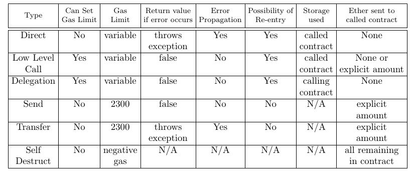

# SmartContractInteractions
Lists examples of all the ways two smart contracts written in Solidity can interact.

I have identified 6 different ways two smart contracts can interact, listed in the table below. There are examples of each type in the CallingContract.sol file. 

We can compare the 6 invocation types using through the following table:

More detailed description on each invocation type will follow in the future.
